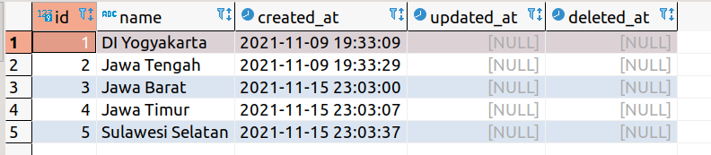

# 7th Week Backend Assessment / Tech Tryout 2
In this assessment we are still using the database with the same structure. but you have to create some API to get data based on param/input :
- create api to get data by input
- create api to get data by searching the keyword

**Deadline**: Sunday, 21 November 2021, 12:00 WIB (12 siang)

## Instructions
- Create new branch (if you already have your branch in this remote repository, update your branch by type ***git pull origin main***) from your branch
- after your branch updated, in terminal you have to go to week5 folder(cd week5) (where the package.json file located)
- type ```npm i``` on your terminal 
- after installation process completed , try to run ```node server.js```
- if the server running well, You can start doing the exercises

## Assessment requirements
- Create this list of api :
  - create api to get province data by district id
  - create api to get province data by sub district id
  - create api to get list of district by province id
  - create api to get list of sub district by province id
- Create api to get data by searching keyword\
for example : \
province data \
 \
  - GET ```localhost:8000/province?keyword=ja```\
    expected output\
    ```
    [
      {
        "id": 2,
        "name": "Jawa Tengah",
        "created_at": "2021-11-09 19:33:29",
        "updated_at": null,
        "deleted_at": null
      },
      {
        "id": 3,
        "name": "Jawa Barat",
        "created_at": "2021-11-15 23:03:00",
        "updated_at": null,
        "deleted_at": null
      },
      {
        "id": 4,
        "name": "Jawa Timur",
        "created_at": "2021-11-15 23:03:07",
        "updated_at": null,
        "deleted_at": null
      },
    ]
    ```
  - GET ```localhost:8000/province?keyword=an```\
    expected output\
    ```
    [
      {
        "id": 5,
        "name": "Sulawesi Selatan",
        "created_at": "2021-11-15 23:03:37",
        "updated_at": null,
        "deleted_at": null
      }
    ]
    ```
  - GET ```localhost:8000/province?keyword=aw```\
    expected output\
    ```
    [
      {
        "id": 2,
        "name": "Jawa Tengah",
        "created_at": "2021-11-09 19:33:29",
        "updated_at": null,
        "deleted_at": null
      },
      {
        "id": 3,
        "name": "Jawa Barat",
        "created_at": "2021-11-15 23:03:00",
        "updated_at": null,
        "deleted_at": null
      },
      {
        "id": 4,
        "name": "Jawa Timur",
        "created_at": "2021-11-15 23:03:07",
        "updated_at": null,
        "deleted_at": null
      },
      {
        "id": 5,
        "name": "Sulawesi Selatan",
        "created_at": "2021-11-15 23:03:37",
        "updated_at": null,
        "deleted_at": null
      }
    ]
    ```

- can run git properly, such as clone, pull, create new branch, push branch

  **note***: you are free to use any package and dbms