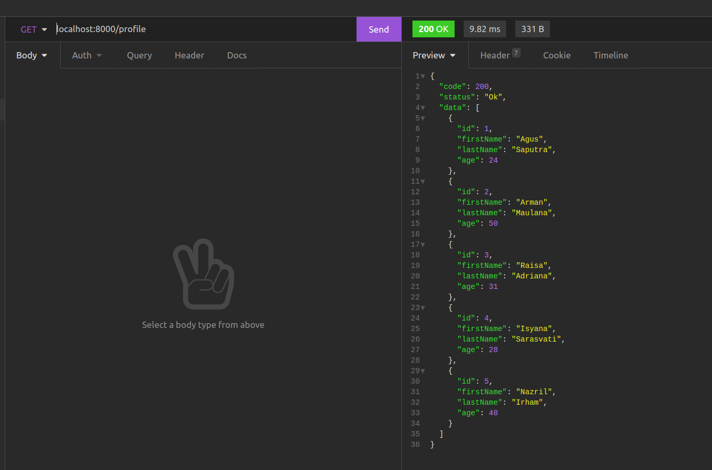

# 5th Week Backend Assessment
In this assessment, you must complete 2 exercises :
- You have to create a function to find, update and delete data.
- You have to create an API to get all data provided

**Deadline**: Sunday, 7 November 2021, 12:00 WIB (12 siang)

## Instructions
- Create new branch (if you already have your branch in this remote repository, update your branch by type ***git pull origin main***) from your branch
- after your branch updated, in terminal you have to go to week5 folder(cd week5) (where the package.json file located)
- type ```npm i``` on your terminal 
- after installation process completed , try to run ```node server.js```
- if the server running well, You can start doing the exercises on the index.js and server.js files  

## Assessment requirements
- Create a function
- function has a parameter
- function has the appropriate process/logic
- api to get all data  

- can run git properly, such as clone, pull, create new branch, push branch