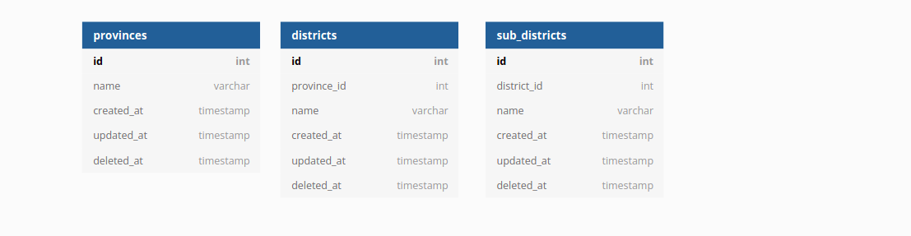

# 5th Week Backend Assessment
In this assessment, you must complete 2 exercises :
- create database with a structure like the one below and its relationships
  
- create crud API at least for 1 table. for example API to get, post, patch/put, and delete provinces

**Deadline**: Sunday, 14 November 2021, 12:00 WIB (12 siang)

## Instructions
- Create new branch (if you already have your branch in this remote repository, update your branch by type ***git pull origin main***) from your branch
- after your branch updated, in terminal you have to go to week5 folder(cd week5) (where the package.json file located)
- type ```npm i``` on your terminal 
- after installation process completed , try to run ```node server.js```
- if the server running well, You can start doing the exercises on the index.js and server.js files  

## Assessment requirements
- create database
- create connection from your backend application to database
- API to crud at least 1 table
- can run git properly, such as clone, pull, create new branch, push branch

  **note***: you are free to use any package and dbms