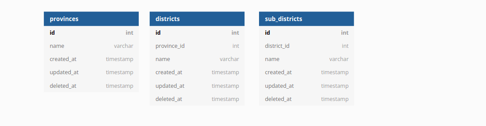

# 5th Week Backend Assessment
In this assessment, you must complete 2 exercises :
- create database with a structure like the one below and its relationships
  
- create crud API at least for 1 table. for example API to get, post, patch/put, and delete provinces

**Deadline**: Sunday, 14 November 2021, 12:00 WIB (12 siang)

## Instructions
- Create new branch (if you already have your branch in this remote repository, update your branch by type ***git pull origin main***) from your branch
- after your branch updated, in terminal you have to go to week5 folder(cd week5) (where the package.json file located)
- type ```npm i``` on your terminal 
- after installation process completed , try to run ```node server.js```
- if the server running well, You can start doing the exercises on the index.js and server.js files  

## Assessment requirements
- create database
- create connection from your backend application to database
- API to crud at least 1 table
- can run git properly, such as clone, pull, create new branch, push branch

  **note***: you are free to use any package and dbms

## Step by step pengerjaan menggunakan sequelize
- Install sequelize
```npm install --save sequelize```
- Install driver database (Postgres)
```npm install --save pg pg-hstore```
- Migration table to databse
  - To install the Sequelize CLI:
  ```npm install --save-dev sequelize-cli```
  - To create an empty project you will need to execute init command
  ```npx sequelize-cli init```
    /*
    This will create following folders

    config, contains config file, which tells CLI how to connect with database
    models, contains all models for your project
    migrations, contains all migration files
    seeders, contains all seed files

    setting di config ->config.json (username, dkk , dialect => postgres)
    */
  - create database :
  ```npx sequelize-cli db:create```
  - create model Provinces:
    - model Provinces:
    `npx sequelize model:create --name Provinces --attributes name:string,deletedAt:date` //id,createdAt, updatedAt sudah otomatis terbuat
    - execute migration to create the Provinces table in database:
    `npx sequelize-cli db:migrate`
    - create seed file u/ Provinces:
    `npx sequelize-cli seed:generate --name provinces`
    - execute seed file:
    `npx sequelize-cli db:seed:all`
  - create model Regencies
    - model regencies:
    `npx sequelize model:create --name Regencies --attributes province_id:integer,name:string,deletedAt:date` //id,createdAt, updatedAt sudah otomatis terbuat
    - execute seed file:
    `npx sequelize-cli db:migrate`
    - create seed file u/ Regencies:
    `npx sequelize-cli seed:generate --name regencies`
    - execute seed file:
    `npx sequelize-cli db:seed:all`
  - create model Districts
    - model districts:
    `npx sequelize model:create --name Districts --attributes regencies_id:integer,name:string,deletedAt:date` //id,createdAt, updatedAt sudah otomatis terbuat
    - tie regencies with districts:
      - edit file subdistricts models , static models
      - edit file district models, static models
      - edit file create-districts.js migrations, add refrences di regencies_id
    - execute seed file:
    `npx sequelize-cli db:migrate`
    - create seed file u/ Districts:
    `npx sequelize-cli seed:generate --name districts`
      - bikin data awal untuk districts
    - execute seed file:
    `npx sequelize-cli db:seed:all`
  - create model Offices
    - model sub_districts:
    `npx sequelize model:create --name Offices --attributes sub_districts_id:integer,name:string,deletedAt:date` //id,createdAt, updatedAt sudah otomatis terbuat
    - tie sub_districts with offices:
      - edit file offices models , static models
      - edit file districts models, static models
      - edit file create-subdistricts.js migrations, add refrences di districts_id
    - execute seed file:
    `npx sequelize-cli db:migrate`
    - create seed file u/ SubDistricts:
    `npx sequelize-cli seed:generate --name subdistricts`
      - bikin data awal untuk districts
    - execute seed file:
    `npx sequelize-cli db:seed:all`
    - create model SubDistricts
    - model sub_districts:
    `npx sequelize model:create --name SubDistricts --attributes districts_id:integer,name:string,deletedAt:date` //id,createdAt, updatedAt sudah otomatis terbuat
    - tie regencies with sub_districts:
      - edit file sub_districts models , static models
      - edit file districts models, static models
      - edit file create-offices.js migrations, add refrences di sub_districts_id
    - execute seed file:
    `npx sequelize-cli db:migrate`
    - create seed file u/ Offices:
    `npx sequelize-cli seed:generate --name offices`
      - bikin data awal untuk offices
    - execute seed file:
    `npx sequelize-cli db:seed:all`
    - create model Users
    - model users:
    `npx sequelize model:create --name Users --attributes sub_districts_id:integer,first_name:string,last_name:string,email:string,password:string,deletedAt:date` //id,createdAt, updatedAt sudah otomatis terbuat
    - tie sub_districts with offices:
      - edit file offices models , static models
      - edit file districts models, static models
      - edit file create-subdistricts.js migrations, add refrences di districts_id
    - execute seed file:
    `npx sequelize-cli db:migrate`
    - create seed file u/ Users:
    `npx sequelize-cli seed:generate --name Users`
      - bikin data awal untuk Users
    - execute seed file:
    `npx sequelize-cli db:seed:all`
- setup REST API
  - install nodemon
  `npm install -d nodemon`
  - install body-parser
  `npm install body-parser`
  - modify package.json
    "start":"nodemon server.js",
    "db:reset" for drop,create database and run migrations, seed a new
    
