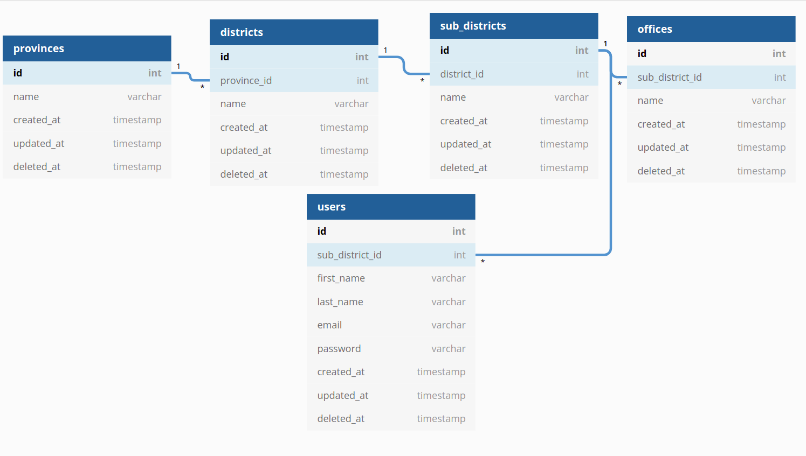
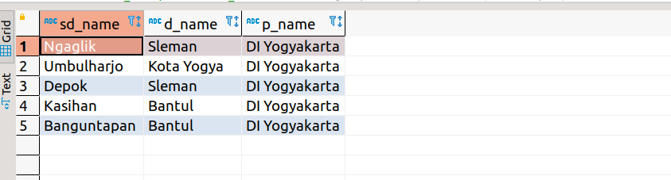

# 8th Week Backend Assessment
In this assessment we are still using the database with the same structure with 2 additional table. and you have to create some API to get data based on param/input :
- create auth api (register and login)
- create api to get data base on user location

**Deadline**: Sunday, 28 November 2021, 20:00 WIB (8 malam)

## Instructions
- Create new branch (if you already have your branch in this remote repository, update your branch by type ***git pull origin main***) from your branch
- after your branch updated, in terminal you have to go to week5 folder(cd week5) (where the package.json file located)
- type ```npm i``` on your terminal 
- after installation process completed , try to run ```node server.js```
- if the server running well, You can start doing the exercises

## Assessment requirements
- You have add 2 table in your database. the new database structure is

- Create this list of api :
  - create register user api
  - create login api
  - create api to get offices by province base on user location\
   \
  for example: \
  user's location in ngaglik, so you have to get offices in the DI Yogyakarta province

- can run git properly, such as clone, pull, create new branch, push branch

  **note***: you are free to use any package and dbms